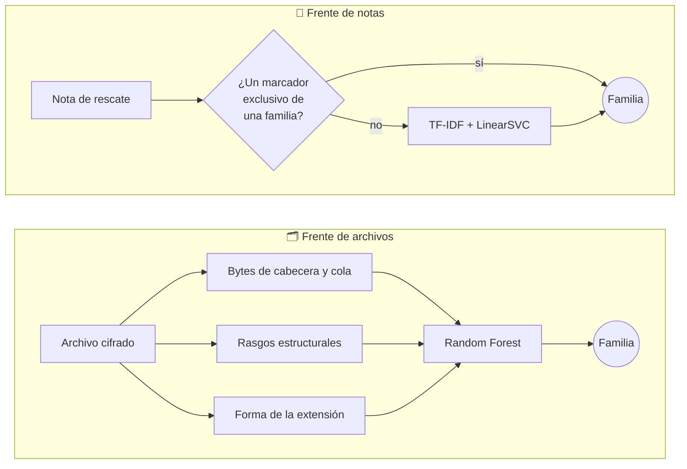

<div align="center">

# Detección de familias de ransomware

### a partir de archivos cifrados y notas de rescate

**Romina Alfonzo** · **Carlos Urdapilleta**

Tesis de grado · Facultad Politécnica · Universidad Nacional de Asunción
Tutor: Prof. Dr. Cristian Cappo

</div>

---

> Después de un ataque de ransomware, el ejecutable que lo causó suele haber desaparecido.
> Quedan dos rastros: los **archivos cifrados** y la **nota de rescate**.
> Este trabajo estudia si cada uno de ellos, por separado, permite decir **qué familia** de
> ransomware atacó, entre las treinta familias del conjunto NapierOne.

## Los dos frentes

|                    | 🗂️ Archivos cifrados | 📝 Notas de rescate |
|--------------------|----------------------|---------------------|
| **Datos**          | NapierOne (Davies, Macfarlane y Buchanan, 2022): 30 familias, una campaña por familia | Corpus propio de notas públicas, con la procedencia de cada nota auditada |
| **Qué se aprende** | Los bytes de cabecera y cola, rasgos estructurales del archivo y la forma de la extensión que agrega el ransomware | Marcadores exactos (correos, direcciones `.onion`, billeteras) y el texto de la nota |
| **Modelo**         | Random Forest | Cascada: reglas sobre marcadores y, si no deciden, TF-IDF + LinearSVC |
| **Validación**     | Validación cruzada estratificada y tipos de documento nunca vistos | Plantilla nunca vista (P2bal) y reparto por nota (P1) |

Los dos frentes son **independientes**: no hay un clasificador que los combine.



## Qué hay en este repositorio

Solo el **código**. Lo demás queda fuera a propósito.

| Carpeta | Contenido | En el repositorio |
|---------|-----------|:-----------------:|
| `2_codigo/` | Los scripts de todos los experimentos, en Python | ✅ |
| `2_codigo/slurm/` | Los trabajos para el clúster (SLURM) | ✅ |
| `2_codigo/family-rw-detection/` | El código original de los experimentos 1 y 2 | ✅ |
| `3_datos/` | El corpus de notas y los archivos cifrados | ❌ malware real |
| `4_resultados/` | Las salidas y los registros de cada corrida | ❌ |
| `1_documento/` | El libro de la tesis (LaTeX) | ❌ |
| `5_bibliografia/` | Los PDF de los artículos citados | ❌ derechos de autor |

> [!WARNING]
> **Los datos no se publican.** Las notas de rescate y los archivos cifrados son artefactos de
> malware real. Subirlos infringiría los términos de uso de GitHub. NapierOne se obtiene de
> sus autores; las notas provienen de fuentes públicas que la tesis cita una por una.

## Mapa del código

<details>
<summary><b>🗂️ Frente de archivos cifrados</b></summary>

| Experimento | Pregunta | Script |
|-------------|----------|--------|
| 1 y 2 | ¿Alcanzan la entropía y el tamaño para detectar el cifrado y la familia? | `reproducir_exp1_exp2.py`, `family-rw-detection/` |
| 2b | ¿Qué marcas fijas escribe cada familia en el archivo? | `deteccion_estructural.py` |
| 2c | ¿Un clasificador aprende esas marcas de los bytes, sin el nombre? | `clasificador_bytes.py`, `analisis_bytes.py`, `ablacion_ventana_extendida.py` |
| 2d y 2e | ¿Qué agregan el nombre del archivo y su forma? | `exp2d_nombre_extension.py`, `exp2e_estructura_bytes.py` |
| 2f a 2h | El sistema completo y sus verificaciones de cierre | `exp2f_sistema_completo.py`, `exp2g_nombre_robusto.py`, `exp2h_cierre_archivos.py` |

</details>

<details>
<summary><b>📝 Frente de notas de rescate</b></summary>

| Paso | Qué hace | Script |
|------|----------|--------|
| Lectura | Pasa cada nota a texto (detecta UTF-16, HTML, HTA) | `extractor_notas.py` |
| Plantillas | Agrupa las notas casi idénticas y entrena el clasificador de texto | `clasificador_notas_v2.py` |
| Protocolos | Reparte entrenamiento y prueba por plantilla (P2bal) | `protocolo_p2bal.py` |
| Cascada | Reglas sobre marcadores, después el texto; abstención por margen | `abstencion_notas.py` |
| Curva | Cuántas plantillas hacen falta por familia | `curva_aprendizaje_notas.py` |
| Linaje | Qué familias se confunden porque comparten el molde de la nota | `confusion_y_linaje.py` |
| Extensiones | Notas públicas de Triage para ampliar el entrenamiento | `copias_triage.py`, `p1_copias_sin_apuntar.py`, `p1_p2bal_plantillas_nuevas.py` |

</details>

## Cómo se corre

Requiere Python 3.11 con `scikit-learn`, `numpy`, `pandas`, `scipy`, `matplotlib` y
`beautifulsoup4`. Cada corrida guarda en un manifiesto las versiones exactas que usó.

```bash
# Frente de notas (necesita el corpus en 3_datos/corpus_v2)
python 2_codigo/protocolo_p2bal.py
python 2_codigo/abstencion_notas.py --protocolo P2bal

# Frente de archivos (necesita NapierOne-small)
python 2_codigo/exp2g_nombre_robusto.py /ruta/a/NapierOne-small

# En el clúster
DATOS=/scratch/<usuario>/Napierone-small sbatch --export=ALL,DATOS 2_codigo/slurm/job_exp2g.sh
```

## Cómo se garantiza cada cifra

- **Predicción antes de correr.** Los experimentos de la última etapa escriben y commitean sus
  predicciones *antes* de ejecutarse, y el resultado se informa aunque no se cumplan.
- **Puerta de entrada.** Los experimentos que se comparan con una cifra ya publicada la
  reproducen primero, y se detienen si no coincide.
- **Repeticiones.** Toda comparación se hace sobre las mismas semillas (cincuenta en el frente de
  notas), con intervalo de confianza de la diferencia pareada.
- **Verificadores.** Dos scripts buscan cada cifra del documento en el registro de la corrida que
  la produjo:

```bash
python 2_codigo/cifras_finales.py --solo-fallas            # frente de notas
python 2_codigo/cifras_finales_archivos.py --solo-fallas   # frente de archivos
```

## Agradecimientos

Los experimentos sobre el conjunto completo de NapierOne se ejecutaron en el clúster del
**Núcleo de Investigación y Desarrollo Tecnológico (NIDTEC)** de la Facultad Politécnica, en el
marco del proyecto **LABO16-167**, financiado por el programa **PROCIENCIA** del Consejo Nacional
de Ciencia y Tecnología (**CONACYT**).

<div align="center">
<sub>Facultad Politécnica · Universidad Nacional de Asunción · Paraguay</sub>
</div>
